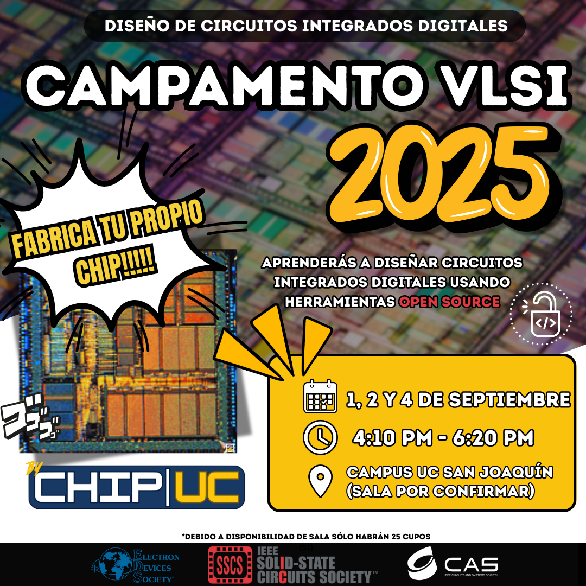

# Campamento VLSI 2025 - PUC


<!-- Esto es un comentario --> 
<!-- [Campamento VLSI 2025](CampVLSI_2025.png)--> 

<div align="center">
  
</div>


## Comandos útiles en Linux

### Navegación de Directorios

```bash
# Cambiar al directorio especificado
cd nombre_del_directorio
```

```bash
# Volver al directorio anterior
cd ..
```

```bash
# Ir al directorio home del usuario
cd
```

### Listado de Archivos y Directorios

```bash
# Listar archivos y carpetas en el directorio actual
ls
```

```bash
# Listar archivos con detalles (permisos, propietario, tamaño, fecha)
ls -l
```

```bash
# Listar archivos, incluyendo los ocultos
ls -a
```

### Manipulación de Archivos y Directorios

```bash
# Crear un nuevo directorio
mkdir nombre_del_directorio
```

```bash
# Eliminar un archivo
rm nombre_del_archivo
```

```bash
# Eliminar un directorio vacío
rmdir nombre_del_directorio
```

```bash
# Eliminar un directorio y su contenido
rm -r nombre_del_directorio
```

```bash
# Copiar archivos o directorios
cp origen destino
```

```bash
# Mover o renombrar archivos o directorios
mv origen destino
```

### Visualización de Archivos

```bash
# Imprimir archivo en terminal
cat nombre_del_archivo
```

```bash
# Ver el contenido de un archivo página por página
less nombre_del_archivo
```


### Editores de Texto

```bash
# Editar un archivo con nano (editor sencillo)
nano nombre_del_archivo
```

```bash
# Editar un archivo con vim (editor avanzado)
vim
```

### Información del Sistema

```bash
# Mostrar el directorio actual
pwd
```

```bash
# Mostrar el espacio libre en disco
df -h
```
